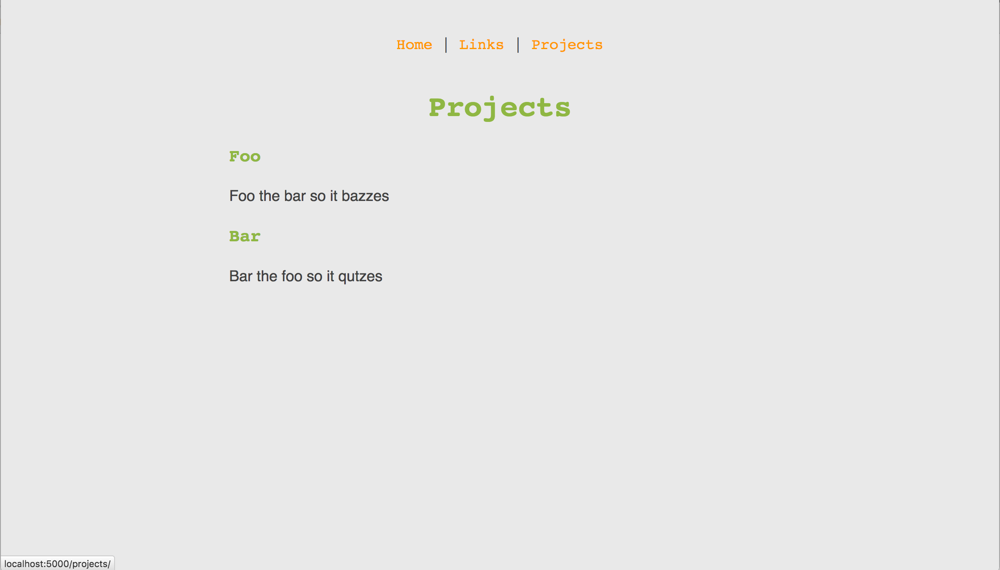

simple website template
================

An overengineered flask template that ultimately just generates a static website. Meant to be used with [GitHub pages](https://pages.github.com/).

I can't claim this is the best way to make your GitHub pages, but it is _a_ way to make GitHub pages.

## Development

0. Install requirements

I made this a long time ago, so it uses python 2.7.
```
# If needed
pip install virtualenv
# Create a python 2.7 virtualenv called flask_env. If your default python is 3.x (as it should be),
# then substitute the path of your python2.7
virtualenv -p /usr/bin/python2.7 flask_env
# activate the virtualenv
source flask_env/bin/activate
pip install -r requirements.txt
```

When you're done working, use the command `deactivate` to exit the virtualenv.

1. Make your feature branch off of `master`

`git checkout -b new_branch`

2. Make your changes (see the next section for details).

3. Build the site.

`python site.py build`

4. Move the rendered pages to the top level of the repository so they will be displayed.

`cp -r build .`

5. Push your changes to the templates _and_ the rendered files to your branch.

6. Make a PR to master and then merge the branch


## Project

### What does `site.py` do?

`site.py` uses the Flask module to connect routes (URLs) to html pages that will be displayed when someone goes to that part of the website.

```python
@app.route("/projects/") # Decorator defines the route
def projects(): # Doesn't matter what the function is called
    # Render this template at this route. It looks for it in the templates/ directory.
    return render_template('projects.html')
```

You can use the command `python site.py` to run the site live. It should be accessible at `http://localhost:5000`, and you can quit with `CTRL + c`. You can refresh the page and it will update with changes without having to re-run the command.

`python site.py build` will use the `flask_frozen` module to save a frozen snapshot of the site in a directory called `build/`.

### Templates

Templates use the [Jinja2](http://jinja.pocoo.org/docs/2.9/) templating system that comes with Flask to compose html pages. TLDR all the html is defined in the `templates` directory.

The main fancy bit of this that's used here is the template inheritance. `base.html` defines the header, footer, and some display scaling.

Links in templates should use the `url_for` method when referring to internal pages. (See `templates/base.html` for an example).

### Directory Structure

Each page of the site lives in its own directory so that it can be accessed as `mainsite.com/projects`. The `index.html` that is the result of rendering the templates of the corresponding name. This makes it easier to find pages, since you don't have to remember to tack on the `.html` suffix.

If you want to add a new page, then you would need to

1. add a function in `site.py` that with the route you want assocaited with it that renders a template in the `templates/` directory
2. add the template, inheriting from the base template (if you want)

Static files (css, javascript, and images used in pages) live in the `static` directory. You can reference different css or javascript files by adding the appropriate tag on the page you want to use it on, e.g.

```html


<link rel="stylesheet" type="text/css" media="screen" href={{ url_for('static', filename="css/style.css") }}>

<script src={{ url_for('static', filename="js/app.js") }}></script>
```

### 404 pages

The `.htcaccess` file is configured to use the static `404.html` page as the 404 page. If you remove it, a generic 404 page is used. The `@app.errorhandler(404)` in `site.py` will serve the 404 page when the site is running live from the command `python site.py`.

## How's the DNS stuff work?

Custom domain is hosted on Namecheap, so follow https://www.namecheap.com/support/knowledgebase/article.aspx/9645/2208/how-do-i-link-my-domain-to-github-pages

There's a confusing bit at the end where they give you conflicting info about deleting duplicate entries, but you should set both `192.30.252.153` and `192.30.252.154` as `A Record`s.

## Is this original?

Tbh I can't reven remember anymore, but I think I cribbed some of this off of an ancient version of (Ronald's)[https://github.com/rskwan/]'s personal website? It all seems like standard usage of the Flask ecosystem though.

## This seems a bit overengineered.

Yeah, at one point there was a blog component to this site and the vague idea of actually having a live site. This could be extended to do something like that, but yes, this is just a build system for a collection of html pages. You could totally also just manually write out the three pages or whatever `¯\_(ツ)_/¯`

## What's it look like?




